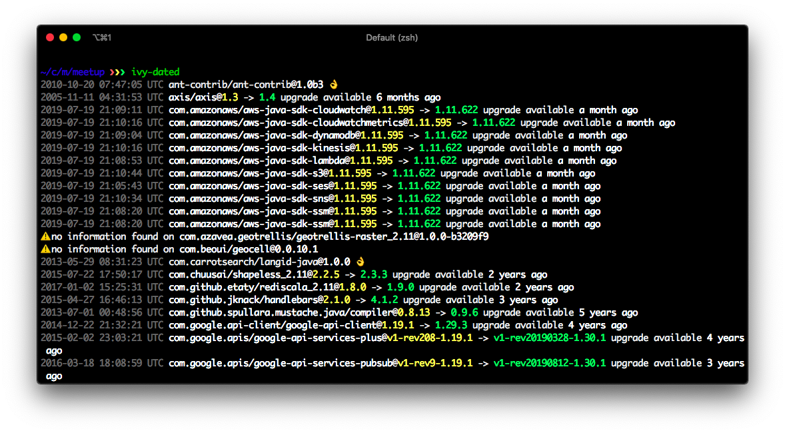

# ivy dated [](https://travis-ci.com/meetup/ivy-dated)  [](https://github.com/meetup/ivy-dated/actions)

> computes the "dated-ness" of a project's dependencies based by cross referencing an ivy configuration with maven central

<p align="center">
  
</p>

## 📦 install

### 🍺 Via Homebrew

```sh
$ tap meetup/tools
$ brew install ivy-dated
```

### 🏷️ Via GitHub Releases

Prebuilt binaries for OSX and Linux are available for download directly from GitHub Releases

```sh
$ curl -L \
 "https://github.com/meetup/ivy-dated/releases/download/v0.0.0/ivy-dated-v0.0.0-$(uname -s)-$(uname -m).tar.gz" \
  | tar -xz
```

## 🤸 usage

You can run this as is in any directory that has an `ivy.xml` file

```sh
$ ivy-dated
```

If you wish you can also specify an ivy file more directly

```sh
$ ivy-dated -f path/to/custom-ivy.xml
```

## 👩‍🏭 development

This is a [rustlang](https://www.rust-lang.org/en-US/) application.
Go grab yourself a copy with [rustup](https://rustup.rs/).

Meetup, Inc.